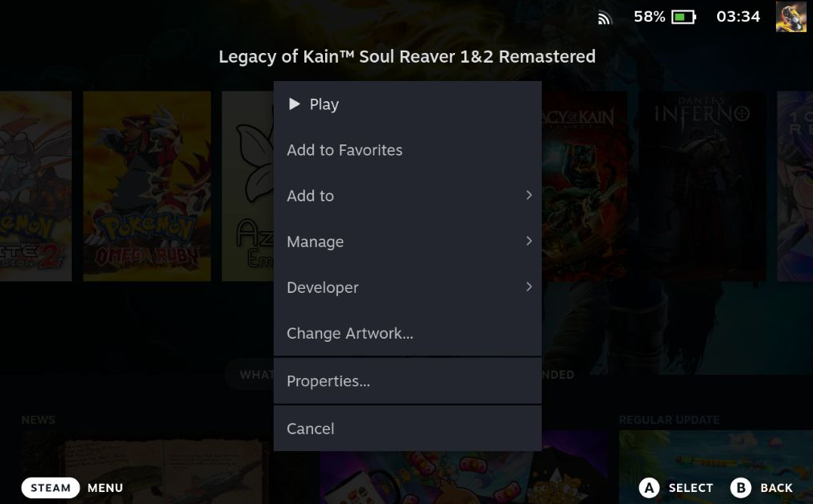
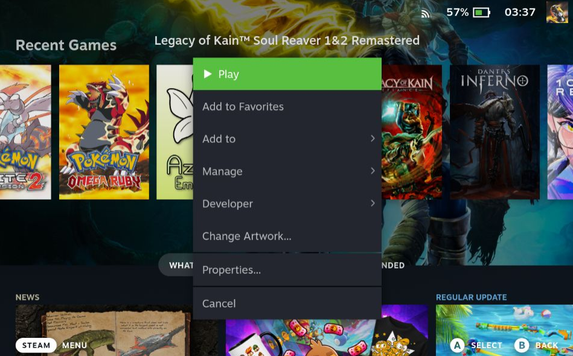

# Kaporli's Tweaks

Provides the following UI tweaks  
* Toggling transparent footer  
* Toggling transparent header  
* Toggling disable darkened background for properties menu  
* Toggling disable blurred background for properties menu  

## Preview

### Footer and Header  

### Blurred Background Off  

### Blur and Dark Off  

