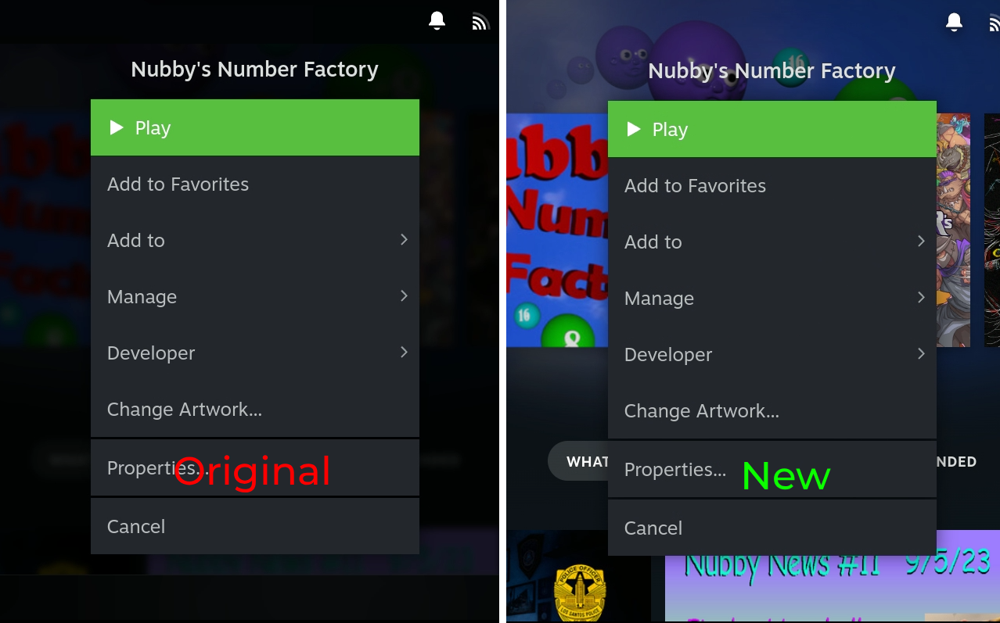

# Kaporli's Tweaks

Kaporli’s Tweaks is a lightweight theme for Decky Loader’s CSS Loader on the Steam Deck, made to fix some annoyances I had with the UI.

##
Provides the following UI tweaks  
* Toggling transparent footer  
* Toggling footer icon dropshadow
* Toggling transparent header  
* Toggling header icon dropshadow
* Toggling disable darkened background for properties menu  
* Toggling disable blurred background for properties menu  
* Changing the opacity of the Steam Menu and the QAM
* Toggling Darkmode for the Steam Menu and the QAM
* Changing the roundness of Steam Menu & QAM corners

## Preview

### QAM

### Steam Menu

### Properties Menu

### Footer

